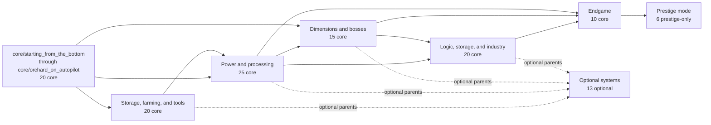
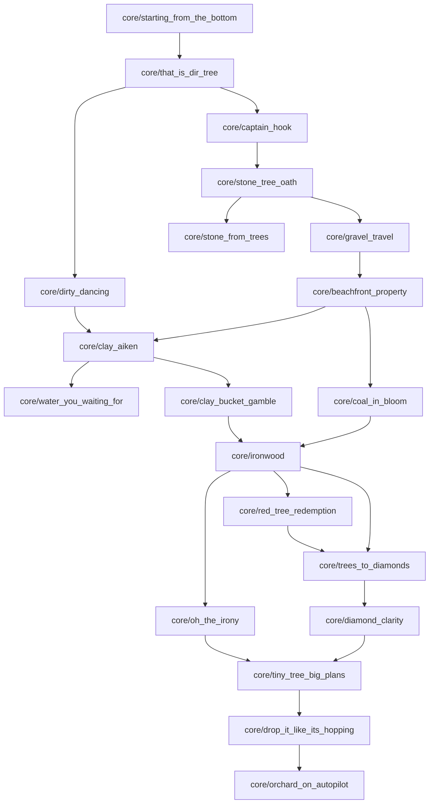
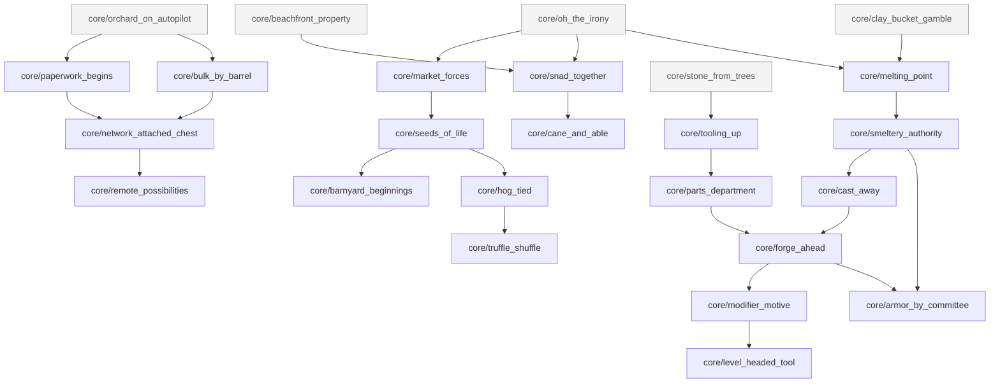
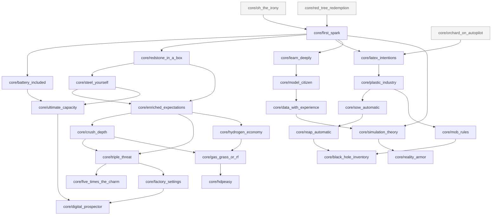
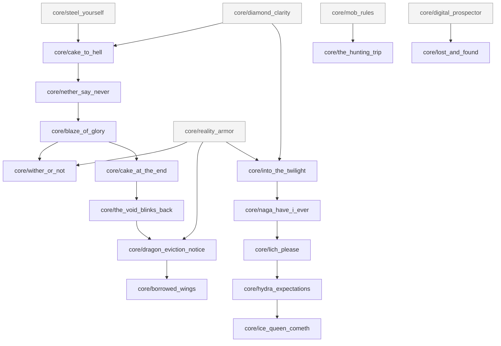
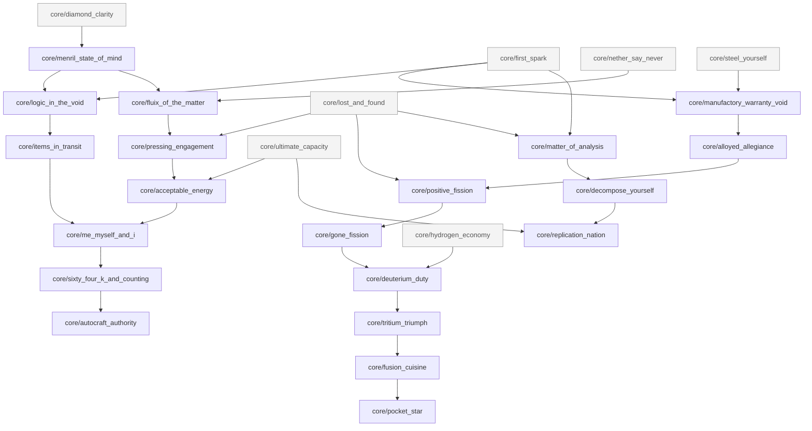
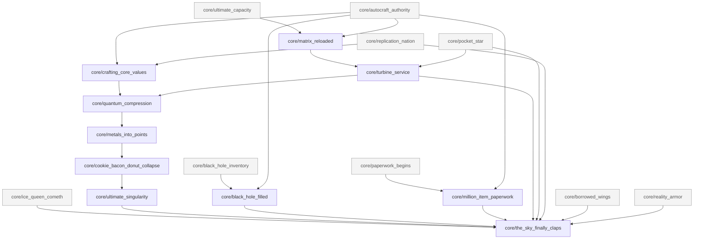
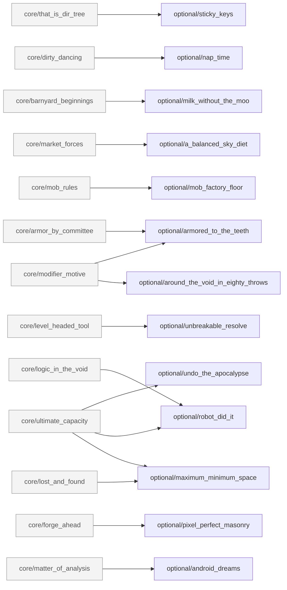
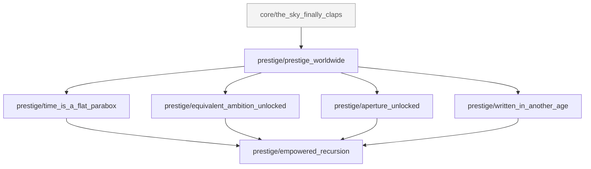

# SF4 Angel Achievement Tree

These diagrams cover all **110 core**, **13 optional**, and **6 prestige-only** achievements. Every arrow is an exact parent relationship from `ACHIEVEMENT_PLAN.md`; repeated pale nodes are cross-phase parents. Node labels omit only the common `sf4angel:` prefix.

## Complete overview

## Bootstrap and resource trees

## Storage, farming, and tools

## Power and processing

## Dimensions and bosses

## Logic, storage, and advanced industry

## Endgame

## Optional systems

## Prestige-only systems

