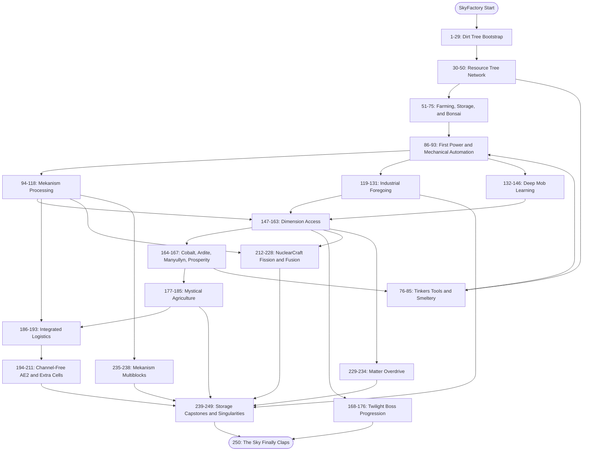
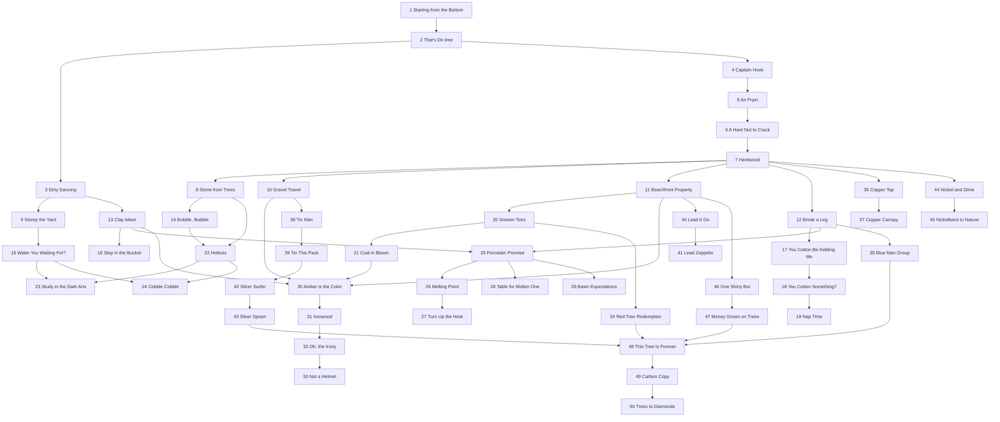
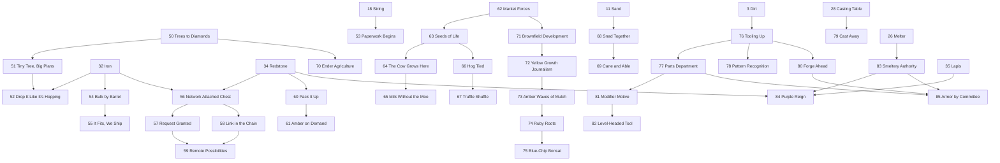
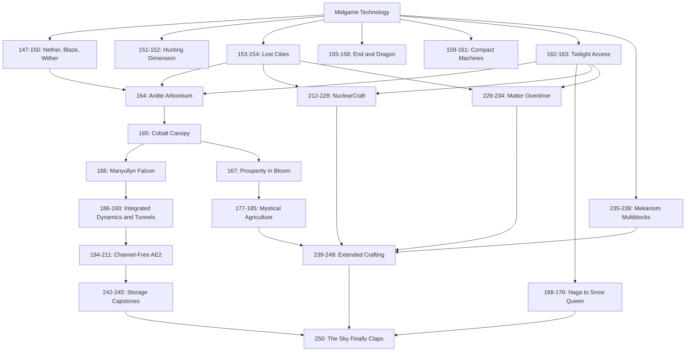
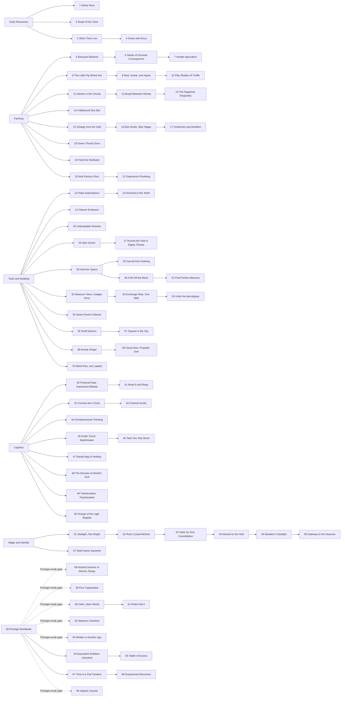

# SF4 Angel Achievement Tree

The numbered ranges correspond to `ACHIEVEMENT_PLAN.md`.

## Complete Overview

## Early Resource Tree

## Farming, Storage, and Tools

## Technology Tree

```mermaid
flowchart TD
    BASE["Iron, Redstone, Smeltery"] --> A86["86 First Spark"]
    A86 --> A87["87 Combustion Discussion"]
    BASE --> A88["88 Geothermal Ambition"]
    A86 --> A89["89 Battery Included"]
    A86 --> A90["90 Wireless Current Events"]
    A86 --> A91["91 Clicks While Away"]
    ANIMALS["Animal Farming"] --> A92["92 Horsepower, Literally"] --> A93["93 Crushing Responsibility"]

    A86 --> A94["94 Redstone in a Box"]
    A94 --> A95["95 Infused with Purpose"]
    A94 --> A96["96 Steel Yourself"]
    A94 --> A97["97 Circuit Training"]
    A95 --> A98["98 Enriched Expectations"]
    A96 --> A98
    A97 --> A98
    A96 --> A99["99 Electric Dreams"]
    A97 --> A100["100 Crush Depth"]

    A95 --> A101["101 Separate Ways"]
    A96 --> A101
    A97 --> A101
    A100 --> A101
    A101 --> A102["102 Hydrogen Economy"] --> A103["103 Gas, Grass, or RF"]

    A98 --> A104["104 Purity of Purpose"]
    A98 --> A105["105 Triple Threat"]
    A100 --> A105
    A104 --> A105
    A104 --> A106["106 Chemical Romance"]
    A106 --> A107["107 Four of a Kind"]
    A106 --> A108["108 Dissolution Solution"] --> A109["109 Wash Cycle"] --> A110["110 Crystal Clear"]
    A107 --> A111["111 Five Times the Charm"]
    A110 --> A111

    A100 --> A112["112 Plastic Fantastic"]
    A102 --> A112
    A112 --> A113["113 HDPEasy"]
    A95 --> A114["114 Cube Route"] --> A115["115 Ultimate Capacity"]
    A98 --> A116["116 Factory Settings"] --> A117["117 Ultimate Tier Installer"]
    A115 --> A118["118 Digital Prospector"]

    TREES["Resource Trees"] --> A119["119 Latex Intentions"] --> A120["120 Rubber Meets the Void"] --> A121["121 Plastic Industry"] --> A122["122 Machine Frame of Mind"]
    A122 --> A123["123 Sow Automatic"]
    A122 --> A124["124 Reap Automatic"]
    A123 --> A125["125 The Farm Farms Back"]
    A124 --> A125
    A122 --> A126["126 Mob Rules"]
    A126 --> A127["127 Liquid Meat Market"]
    A126 --> A128["128 Pink Slime Time"]
    A122 --> A129["129 Bore from Nothing"] --> A130["130 Laser-Focused Resources"]
    A122 --> A131["131 Black Hole Inventory"]

    BASE --> A132["132 Learn Deeply"] --> A133["133 Model Citizen"]
    A133 --> A134["134 Zombie by Numbers"] --> A135["135 Data with Experience"]
    A135 --> A136["136 Simulation Theory"]
    A133 --> A137["137 Polymer Clay Day"]
    A135 --> A138["138 Matter of Record"]
    A136 --> A138
    A137 --> A138
    A138 --> A139["139 Pristine Condition"] --> A140["140 Fabricated Loot"]
    A133 --> A141["141 Skeleton Crew Data"]
    A133 --> A142["142 Enderman Analytics"]
    A133 --> A143["143 Withering Research"]
    A133 --> A144["144 Dragon Dataset"]
    A135 --> A145["145 Glitch in the System"] --> A146["146 Reality Armor"]
```

## Dimensions and Endgame

## Optional Branches

