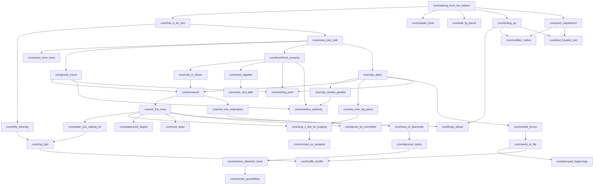
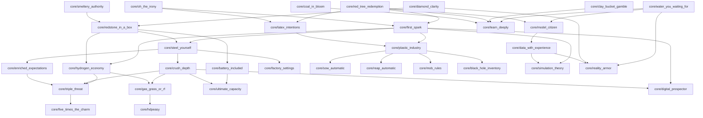
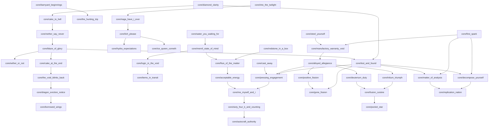
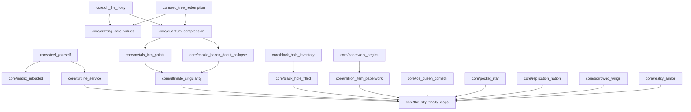
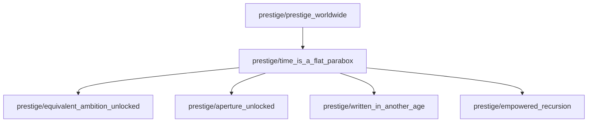

# SF4 Angel Achievement Tree

These diagrams cover all **110 core**, **13 optional**, and **6 prestige-only** achievements. Every arrow is an achievement prerequisite from `ACHIEVEMENT_PLAN.md`. Page-root display attachment for achievements with no prerequisites is intentionally omitted because it is not a completion dependency.

## Early core

## Technology

## Midgame

## Endgame

## Optional

## Prestige

