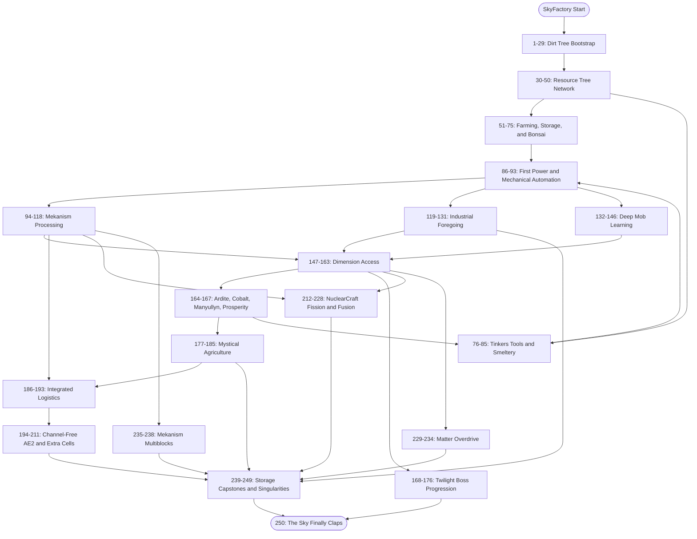
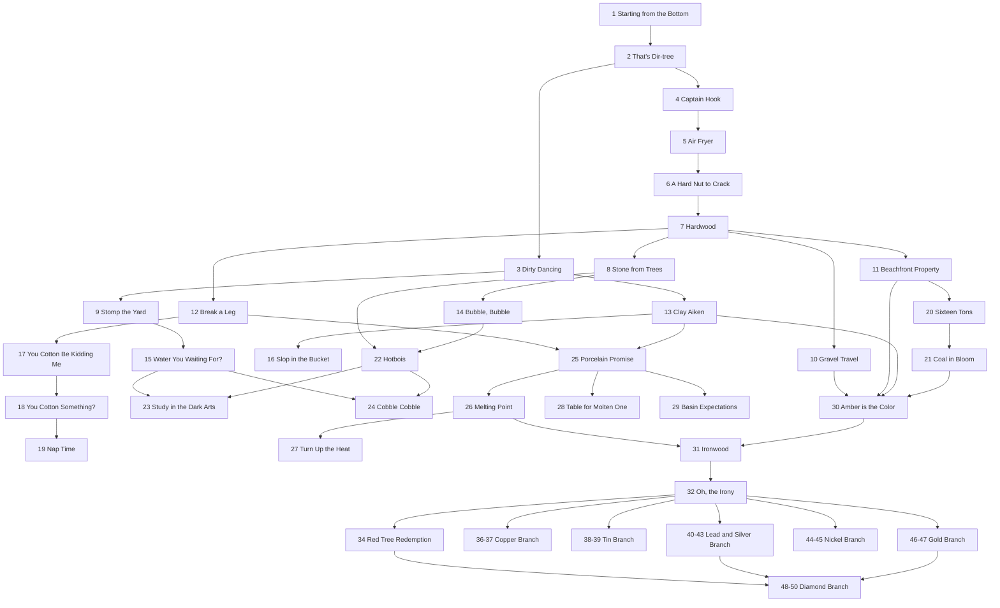

# SF4 Angel Guide

SF4 Angel Guide is a client-and-server Forge mod for Minecraft 1.12.2 that gives SkyFactory 4 a visible in-world guide. A glowing cube-shaped angel appears for important moments, presents progression messages through an action-bar typewriter, and reacts to the custom `sf4angel` Triumph advancement tree.

The mod is designed for a customized SkyFactory 4 instance. It is not a standalone replacement for the modpack's quests or advancement configuration.

## Features

- Owner-specific angel entities for multiplayer-safe spawning and despawning
- White rotating cube model with an independently rotating gold square halo
- Emissive rendering, particles, body sway, and several distant movement patterns
- Typewriter messages with a moving cursor, reverse-untyping, queue priorities, and immediate red warnings
- Login, respawn, health, attack, and achievement reactions
- A congratulation for every completed non-root `sf4angel:*` advancement
- Linear next-goal prompts without forcing unrelated achievements into that sequence
- Persisted counters for play time, kills, deaths, mined blocks, appearances, breeding, and dimension visits
- Java-backed conditions for achievements Triumph cannot express reliably

## Requirements

- Minecraft 1.12.2
- Minecraft Forge 14.23.5.2859
- Java Development Kit 8 for building
- SkyFactory 4 and its configured Triumph 3.19.2 advancement scripts at runtime

## Installation

1. Build the mod or obtain `sf4angel-1.0.0.jar` from a trusted release.
2. Place the jar in the SkyFactory 4 instance's `mods` directory.
3. Install the matching custom Triumph scripts under `config/triumph/script/sf4angel/`.
4. Start the pack and confirm that the log contains `Registered EntityAngelRender during preInit`.

The mod jar alone does not contain the live 348-script Triumph tree. Advancement layout, titles, parent relationships, and most item criteria are supplied by the instance configuration.

## Build

Use a 64-bit JDK 8. Newer Java versions are not supported by this Minecraft/ForgeGradle toolchain.

```powershell
$env:JAVA_HOME = "C:\path\to\jdk8"
.\gradlew.bat clean build
```

The reobfuscated mod jar is written to `build/libs/sf4angel-1.0.0.jar`.

The first build downloads ForgeGradle, Forge, mappings, and other dependencies, so it requires network access and can take several minutes.

## Runtime Integration

Triumph handles criteria that can be represented declaratively, such as inventory changes and completed prerequisite advancements. `AchievementHandler` grants criteria that need server-side state or Forge events, including:

- Play-time, kill, death, block-breaking, breeding, and angel-appearance counters
- High-damage attacks and specific angel interactions
- Dimension visits, deep-sky/void positions, and visited-dimension totals
- Repeated crouching near a sapling and placing water in the Nether

Ambiguous goals are intentionally not granted from broad proxies. For example, network-wide RF/t generation, total storage-network contents, and mod-specific tool state require dedicated integrations before they can be measured truthfully.

## Project Layout

| Path | Purpose |
| --- | --- |
| `src/main/java/com/godh00d/sf4angel/entity/` | Angel entity, renderer, and model |
| `src/main/java/com/godh00d/sf4angel/handler/` | Player lifecycle, ticks, achievements, and counters |
| `src/main/java/com/godh00d/sf4angel/typewriter/` | Per-player action-bar message queues |
| `src/main/java/com/godh00d/sf4angel/personality/` | Angel dialogue selection |
| `src/main/java/com/godh00d/sf4angel/knowledge/` | Goal and inventory guidance |
| `src/main/java/com/godh00d/sf4angel/network/` | Forge SimpleNetworkWrapper messages |
| `src/main/resources/` | Forge metadata, language data, and the angel texture |

## Troubleshooting

- **The build uses the wrong Java version:** set `JAVA_HOME` to a JDK 8 installation in the same terminal before running Gradle.
- **The angel is invisible:** verify client-side installation and look for the renderer registration line in `logs/latest.log`.
- **Achievements are absent or malformed:** inspect Triumph parsing errors in `logs/latest.log` and verify the instance's `config/triumph/script/sf4angel/` directory.
- **A Java-managed achievement does not complete:** both client and server must run the same jar, and the Triumph advancement ID must match the ID used by `AchievementHandler`.
- **A replaced jar remains locked:** fully close Minecraft and its launcher process before replacing the file.

## Development Status

This repository is an instance-specific work in progress. The Java mod builds successfully, but there is currently no automated test suite. Validation consists of a clean Gradle build, Triumph script checks, and an in-game Forge log/runtime pass.

## Achievement Tree



- [Detailed achievement trees](ACHIEVEMENT_TREE.md)
- [All 250 main and 70 optional achievement names](ACHIEVEMENT_PLAN.md)

### Early-Game Branches



### Optional Branches

```mermaid
flowchart TD
    MAIN([Main Progression])
    MAIN --> FARMING["Farming Challenges"]
    MAIN --> BUILDING["Tools and Building"]
    MAIN --> LOGISTICS["Advanced Logistics"]
    MAIN --> MAGIC["Magic and Exploration"]
    MAIN --> PRESTIGE["Prestige-Mode Unlocks"]

    FARMING --> B5["Barnyard Botanist"] --> B7["Hostile Agriculture"]
    FARMING --> B8["This Little Pig Mined Ore"] --> B10["Fifty Shades of Truffle"]
    FARMING --> B11["Kitchen in the Clouds"] --> B13["The Dagwood Singularity"]

    BUILDING --> B22["Plate Expectations"] --> B23["Armored to the Teeth"]
    BUILDING --> B26["Spin Doctor"] --> B27["Around the Void in Eighty Throws"]
    BUILDING --> B32["Measure Twice, Gadget Once"] --> B34["Undo the Apocalypse"]

    LOGISTICS --> B40["Practical Data"] --> B41["Read It and Reap"]
    LOGISTICS --> B42["Connect the X-Dots"] --> B43["Channel Surfer"]
    LOGISTICS --> B45["Ender Chest Matchmaker"] --> B46["Tank You Very Much"]

    MAGIC --> B51["Starlight, Star Bright"] --> B56["Gateway to the Heavens"]
    MAGIC --> B57["Shell Game Supreme"]

    PRESTIGE --> B62["Aperture Unlocked"]
    PRESTIGE --> B64["Equivalent Ambition Unlocked"] --> B65["Tablet of Excess"]
    PRESTIGE --> B67["Time Is a Flat Parabox"] --> B68["Empowered Recursion"]
```


